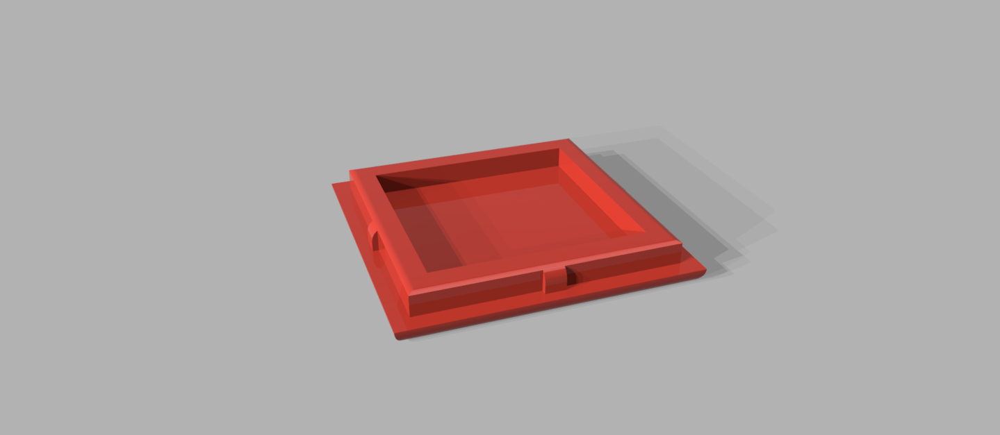
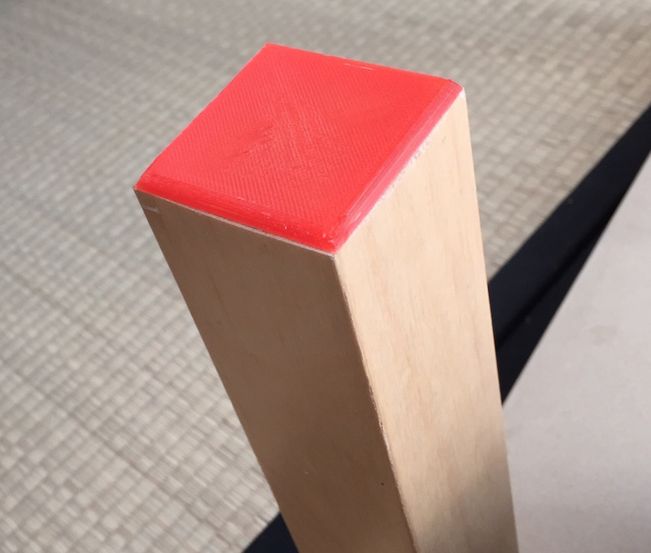

# End-cap for IKEA Lack table leg

If you want to shorten the table leg of an IKEA Lack table, you might
want to put an end-cap on the leg after you have sawed it off.  The
leg is hollow so it will need something to plug the hole and stabilize
the leg.

This end-cap is press-fit so you won't have to glue it.  Just Use
(The) Force and push it in.

